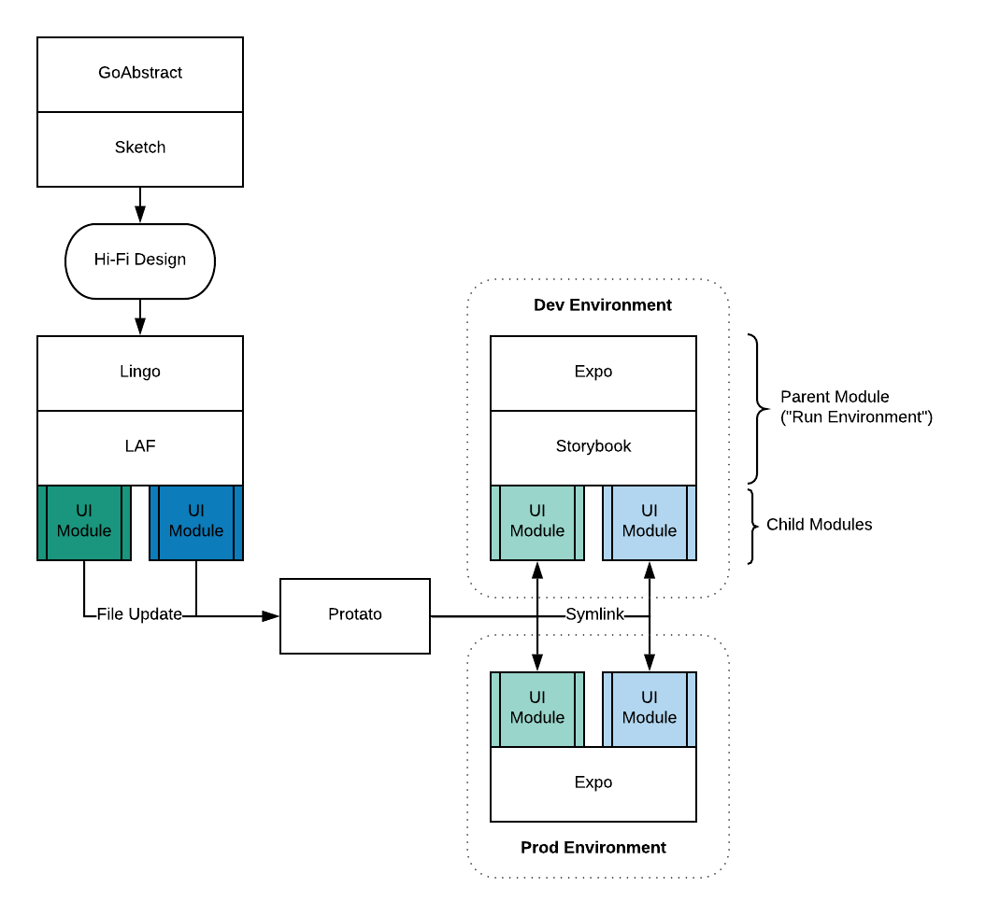

> HMR. Auto-update parent module's child dependency when you update that child dependency's file

## FAQ

<details>
  <summary>Why</summary>
There are a lot of great projects (lerna, yarn workspaces, vscode) that solve code organization issues. I wanted a HMR tool that parsed a config and worked with my monolith tool of choice ( <a href="https://www.npmjs.com/package/repo-genesis">repo-genesis</a> )

This is a summary of how Protato fits into my design/development flow.

</details>

<details>
  <summary>How</summary>
  Under the hood, this is using <a href="https://github.com/whitecolor/yalc">yalc</a> which avoids some of the pain points around NPM global modules. 
  
  The reason I went with yalc was because of the difficulty of installing or linking modules to a specific directory in a cross-platform way.
  
  <b>References</b>
  * <a href="https://docs.npmjs.com/files/folders">npm-folders</a>
  * <a href="https://github.com/servexyz/protato-lib/pull/6">protato-lib/pull/6</a> for a play-by-play of the discovery process(all the things to not do)
</details>

<details>
<summary>Name</summary>
The logo consists of a potato replacing the blue crystal in a Protoss <a href="https://liquipedia.net/starcraft2/Pylon_(Legacy_of_the_Void)">Pylon</a>
<br />
<br />
<ul>
  <li>“Protato” is a portmanteau of “potato” and “protoss”</li>
  <ul>
    <li>“Potato” from “hot potato”</li>
    <li>“Protoss” because of 2-way teleporting (warp gate, recall, etc)</li>
  </ul>
</ul>

</details>

## Install (Optional)
> If you'd rather not install, you can use [npx](https://www.npmjs.com/package/npx) 

* **Install CLI globally**
`npm install -g protato`


* **Install CLI as dev dependency**
`npm install -D protato`

## Usage

Watch your files and update your dependency tree automatically
```
protato watch
```

---


## CLI `Config` 
> In order to watch your files, you need to supply protato with a config file.


**Example used in unit tests**
```json
{
	"parent": {
		"dir": "sandbox/node-starter"
	},
	"children": [
		{
			"dir": "sandbox/npm-starter-sample-module",
			"src": "src"
		},
		{
			"dir": "sandbox/library-genesis",
			"src": "src"
		}
	]
}
```

**Abstract example**

* `protato-cli` 
  * `protato-lib`
  * `tacker`

In this project example, I want "protato-cli" to update its dependencies whenever "protato-lib" or "tacker" are updated locally. Let's say I changed `protato-lib/src/index.js`, it would then trigger an update which would re-link the packages. 

**Breaking down the example**

| Name         | Category              | Attributes Description                                                    |
|:-------------|:----------------------|:--------------------------------------------------------------------------|
| protato.json | Config file name      | this file should be declared at the root of your project                  |
| parent       | Top-level key         | this represents your entry point project; it relies on your child modules |
| children     | Top-level key         | modules you are working on locally                                        |
| dir          | Parent & Children key | root of children to watch or parent project to update; relative from cwd  |
| src          | Children key          | specific directory to watch                                               |

---

## Roadmap

### CLI `Commands`

| Status                  | Name     | Description                                                      |
|:------------------------|:---------|:-----------------------------------------------------------------|
| :white_check_mark:      | `watch`  | Begin watching your child modules for updates                    |
| :ballot_box_with_check: | `yalc`   | List your current packages; install yalc if directory not found. |
| :ballot_box_with_check: | `config` | Generate an empty config if you don't have one in your CWD.      |

### CLI `Flags`

| Status                  | Name     | Description                                          |
|:------------------------|:---------|:-----------------------------------------------------|
| :white_check_mark:      | `--help` | Print help menu                                      |
| :ballot_box_with_check: | `--link` | Add child package symlink in your parent project     |
| :ballot_box_with_check: | `--add`  | Pull child package contents into your parent project |

### Minor Features

* Currently doesn't handle builds. 
> TODO: Create CLI flag and library logic to parse "build" in package.json before updating dependency

* Each module assumes the same CWD.
> TODO: Enable per-child-module cwd. Add object to config and handle parsing
